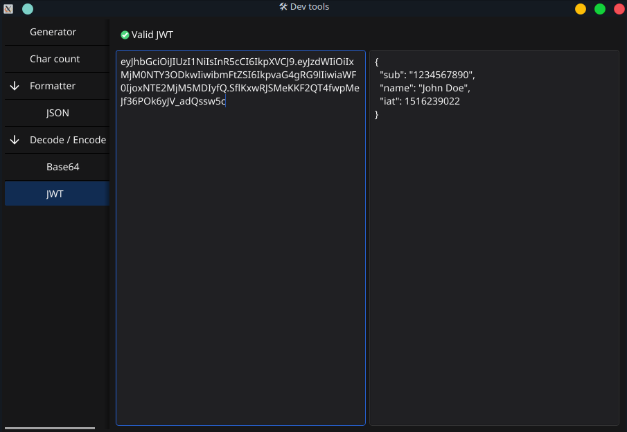

# Dev tools
Developer tools in minimalistic desktop app written in Go and [fyne](https://fyne.io/)

## Features
- Generator
  - UUID
- Char count
- Formatter
  - JSON
- Encode / Decode
  - Base64
  - JWT

## Packaging

> fyne-cross linux

> fyne-cross windows
